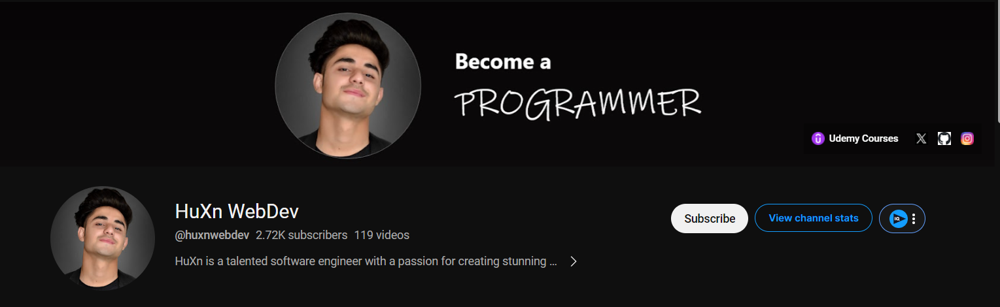
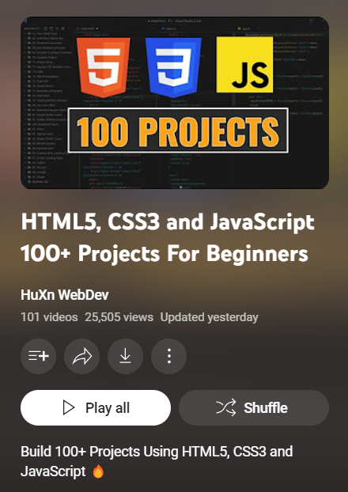

# HTML_CSS_JS_HuXn-Series

<hr>

## What is this?

- This repo is me following 'HuXn WebDev' from YouTube on his journey to complete 100+ projects on HTML, CSS, and JavaScript.

- Currently, I am a beginner in web development. So, I have picked this project as a practice series in order to improve my skills on HTML, CSS, and JavaScript.

- I will be working with git and github during this process and I will try to be as consistent as possible. 

<hr>

```YouTube Channel:``` 


```YouTube Playlist:```


